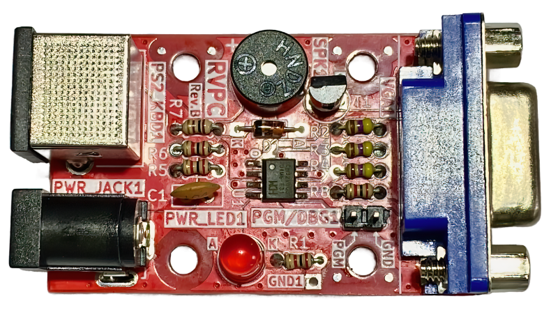
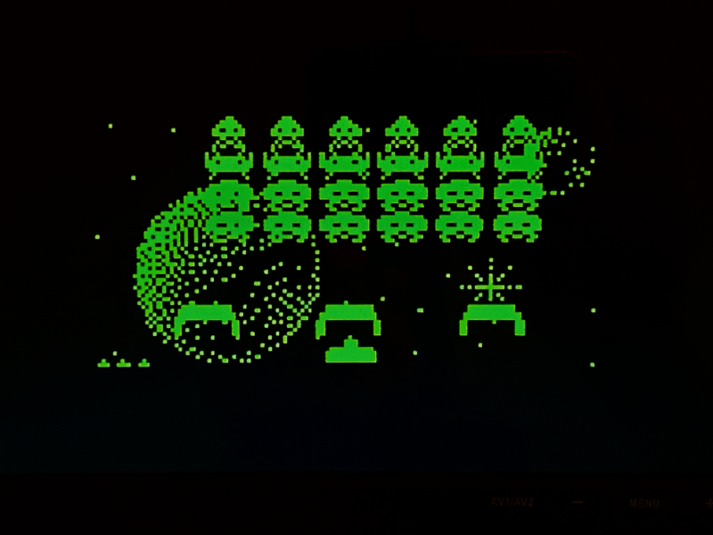
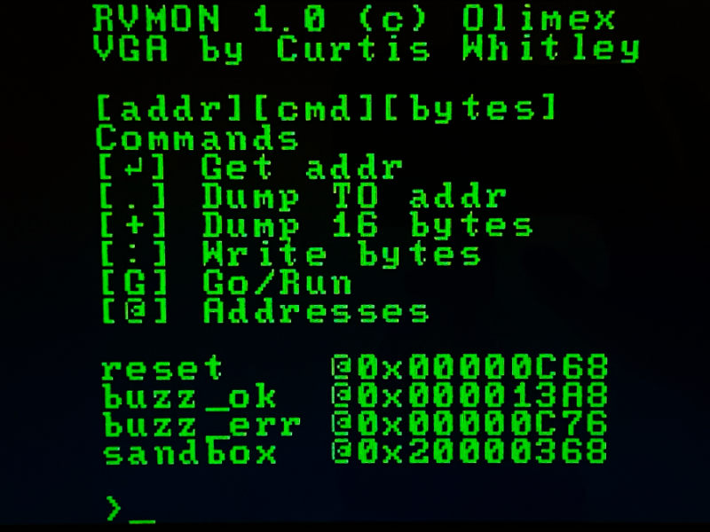
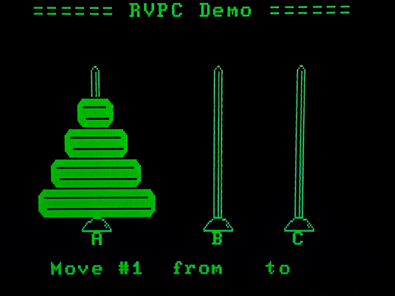
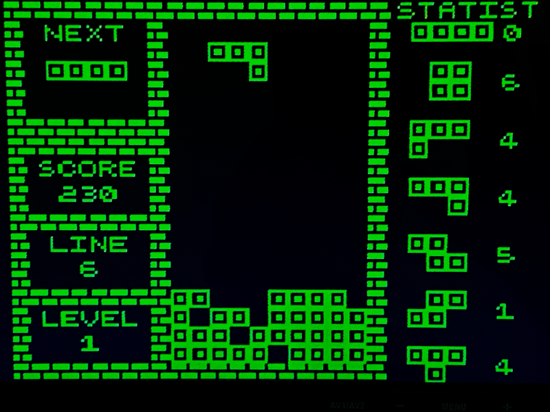

# RVPC Port to CH32LibSDK

This project is a port of the RVPC (the EURO 1.00 RISC-V personal computer with VGA, keyboard, and Woz-like monitor)
from Olimex to the CH32LibSDK. Thanks to this port, the original RVPC gains the following improvements:

- Higher-quality VGA output
- Games from TinyGames by [@Electro_L_I_B](https://x.com/Electro_L_I_B)
- For RVPC with CH32V002, additional games for BabyPad by [@NemecekPanda38](https://x.com/NemecekPanda38)

## Supported Video Modes

The original RVPC with CH32V003 supports two video modes:

### **VMODE 0**

Graphic mode with 128x64 resolution

**TinyGames** by [@Electro_L_I_B](https://x.com/Electro_L_I_B):
- [TArkan](../../Rvpc/Games/TArkan)
- [TBert](../../Rvpc/Games/TBert)
- [TBike](../../Rvpc/Games/TBike)
- [TBomber](../../Rvpc/Games/TBomber)
- [TDDug](../../Rvpc/Games/TDDug)
- [TDoc](../../Rvpc/Games/TDoc)
- [TInvader](../../Rvpc/Games/TInvader)
- [TMissile](../../Rvpc/Games/TMissile)
- [TMorpion](../../Rvpc/Games/TMorpion)
- [TPipe](../../Rvpc/Games/TPipe)
- [TPlaque](../../Rvpc/Games/TPlaque)
- [TSQuest](../../Rvpc/Games/TSQuest)
- [TTrick](../../Rvpc/Games/TTrick)
- [TTris](../../Rvpc/Games/TTris)

**TINVADERS**

### **VMODE 8**

Text mode 23x18 with an 8x8 pixel font using the original RVPC font

Original RVPC software ported to CH32LibSDK:

- [demo-rvmon](../../Rvpc/Games/demo-rvmon)
- [demo-tetris](../../Rvpc/Games/demo-tetris)
- [demo-towers](../../Rvpc/Games/demo-towers)
- [demo-towers-interactive](../../Rvpc/Games/demo-towers-interactive)

**RVMON**

**TOWERS**

For RVPC with CH32V002, an additional video mode is available:

### **VMODE 1** 

Graphic mode with 160x120 resolution

BabyPad/BabyPC games by [@NemecekPanda38](https://x.com/NemecekPanda38):

- [ch32v002-Eggs](../../Rvpc/Games/ch32v002-Eggs)
- [ch32v002-Fifteen](../../Rvpc/Games/ch32v002-Fifteen)
- [ch32v002-Invaders](../../Rvpc/Games/ch32v002-Invaders)
- [ch32v002-Life](../../Rvpc/Games/ch32v002-Life)
- [ch32v002-Tetris](../../Rvpc/Games/ch32v002-Tetris)
- [ch32v002-Train](../../Rvpc/Games/ch32v002-Train)
- [ch32v002-TVTennis](../../Rvpc/Games/ch32v002-TVTennis)

**TETRIS**

## Links

- [Olimex RVPC](https://www.olimex.com/Products/Retro-Computers/RVPC/open-source-hardware)
- [Olimex RVPC Original Firmware](https://github.com/OLIMEX/RVPC)
- [TinyJoypad](https://www.tinyjoypad.com)
